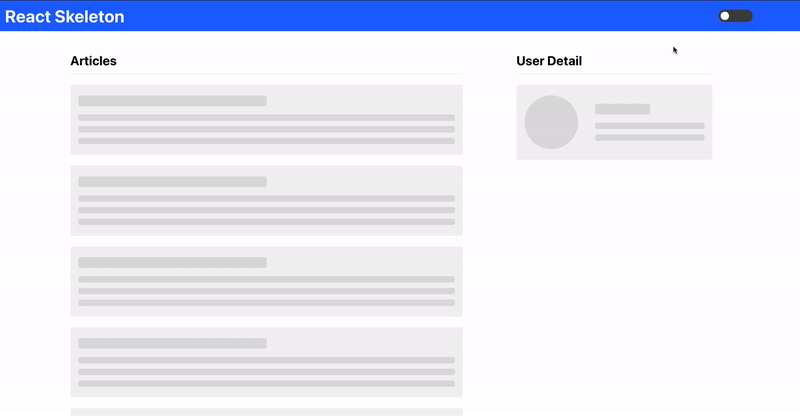

# React skeleton screens

## Overview

유튜브 강의 [React Skeleton Screens Tutorial](https://www.youtube.com/playlist?list=PL4cUxeGkcC9i6bZhMuAzQpC6YgLmB4k4-)를 기반으로 만든 react skeleton screens

### Skeleton
<div style="display: flex; justify-content: space-evenly; margin-bottom: 30px">


</div>

Skeleton이란 데이터를 가져오기 전에 화면에 보여주는 뼈대같은 느낌으로, 사용자가 어떠한 형태로 데이터가 보여질지를 짐작하게 해준다. 또한 단순히 로딩 화면보다 기다리는 시간이 덜 지루하게끔 도와준다.

## How to run

```
$ npm install
$ npm start
```